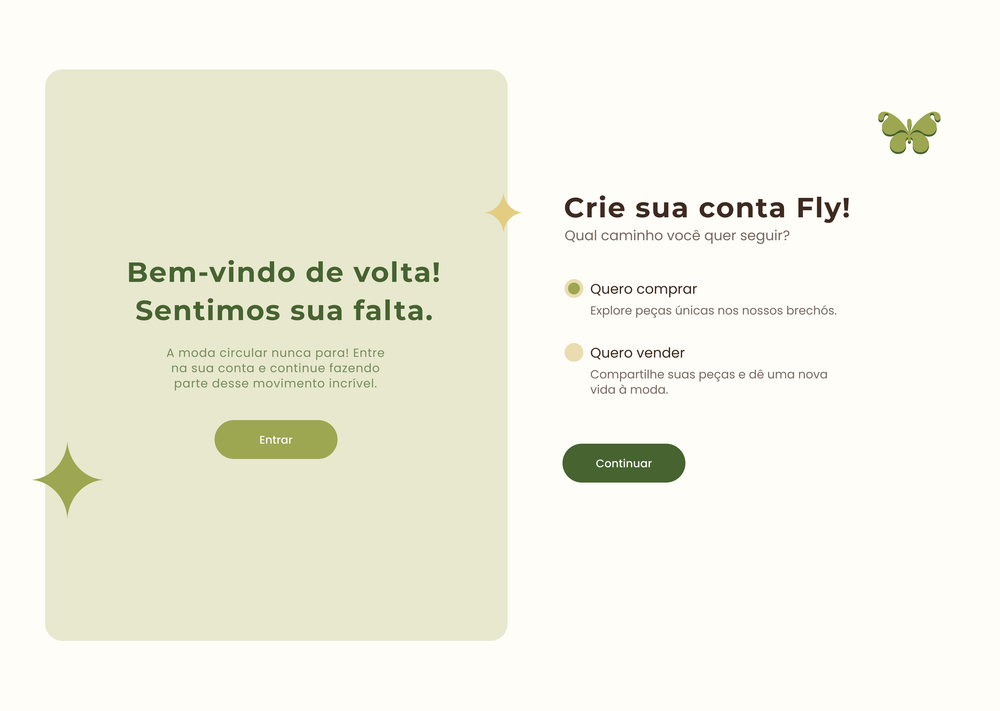
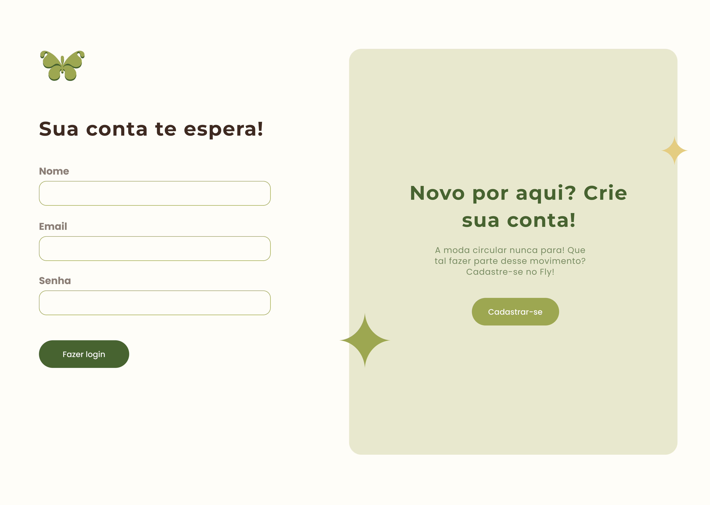
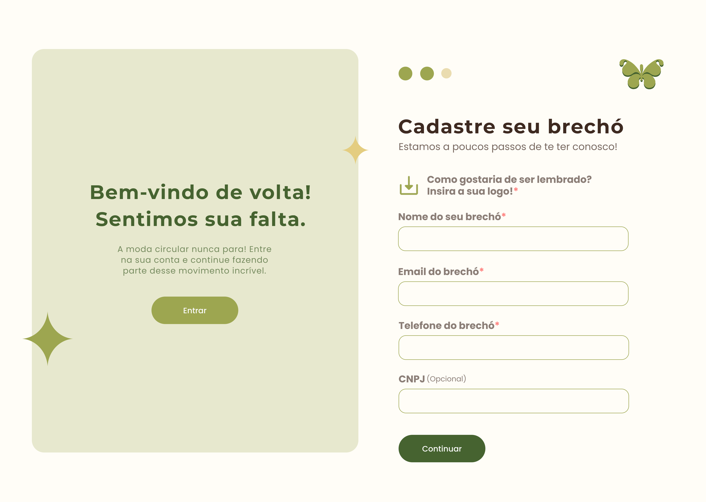
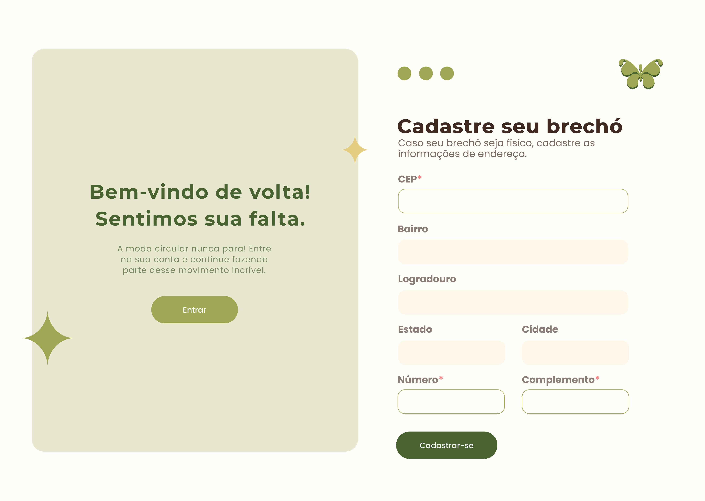
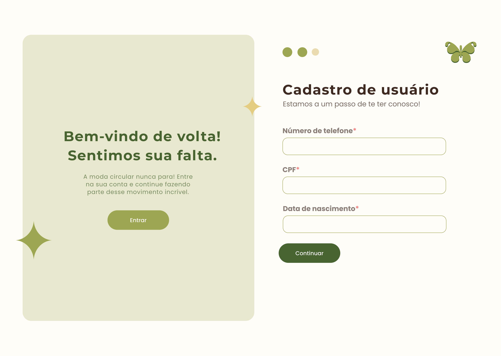
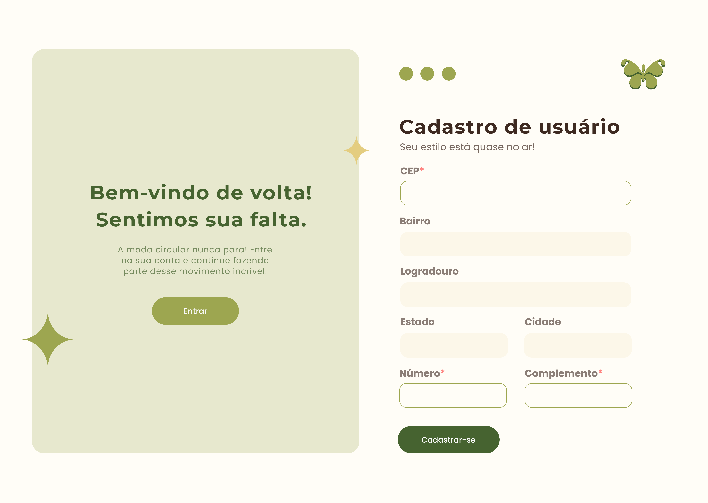

# Fly
## Descrição
  O Fly é um aplicativo inovador que nasceu com o propósito de dar mais visibilidade aos brechós e facilitar a vida dos consumidores apaixonados pela moda sustentável. A plataforma permite que os usuários encontre brechós e através deles descubram peças únicas, tornando possível fazer compras de forma prática e eficiente.
  A ideia do Fly surgiu da experiência pessoal de um dos membros do nosso grupo de desenvolvedores. Sua mãe é dona de um brechó e, diariamente, enfrenta o desafio de alcançar novos clientes e tornar seu negócio mais conhecido. Essa realidade nos motivou a criar uma solução tecnológica que beneficie tanto pequenos empreendedores quanto consumidores que buscam alternativas mais acessíveis e ecológicas no mundo da moda.
  Com isso, estamos desenvolvendo o Fly, um aplicativo pensado para conectar brechós a um público maior, incentivando o consumo consciente e valorizando peças cheias de história. Acreditamos que, com essa iniciativa, poderemos transformar a forma como as pessoas descobrem e interagem com o universo dos brechós.

## Requisitos Funcionais

- **RF01 Cadastro usuário:** O sistema deve permitir que o usuário possa se cadastrar no site ao preencher as informações requeridas no cadastro.
- **RF02 Cadastro brechó:** Ao preencher os dados no cadastro, o sistema permite que o dono do brechó consiga anunciar os seus produtos.
- **RF03 Login:** O sistema deve permitir que as pessoas que se cadastraram possam sair da conta e recuperar as suas informações quando logar.
- **RF04 Cadastro de produtos:** O sistema possibilita que o brechó cadastre diversos produtos, adicionando fotos dos produtos, descrições detalhadas, categorias em seus produtos, como por exemplo “Camiseta”, “Saia”, “Vestido Longo”  e informações sobre o estado de conservação.
- **RF05 Busca de produtos:** O sistema deve possibilitar que o usuário possa buscar produtos por categorias, estilos e tamanhos.
- **RF06 Compras:** O sistema deve permitir um sistema de compra, sendo assim poder realizar compras dentro da plataforma da Fly, toda essa ação será realizada por meio de um chat.
- **RF07 Cadastrar Endereços:** O sistema deve permitir que o usuário e o brechó cadastrem seus endereços ao cadastrar-se na plataforma da Fly, assim podendo ser possível localizar o brechó ou realizar alguma entrega de produto de um brechó para algum cliente
- **RF08 Gestão de Estoque:** O administrador deve ter acesso a gestão de estoque, onde ele irá conseguir alterar a quantidade de produtos no estoque de determinado brechó. Já o brechó deve conter as mesmas funcionalidades porém somente com seus produtos.
- **RF09 Lista de Compras:** O sistema possibilita que o usuário adicione produtos a sua Winxs (sua lista de compras), dentro de sua Winxs os produtos adicionados serão separados pelo brechó no qual eles pertencem, além disso, será permitido que os itens adicionados sejam excluídos e que o usuário converse com o brechó responsável através do chat.
- **RF10 Avaliação de Brechó:** O sistema deve permitir que o usuário possa avaliar um brechó cadastrado no site da Fly a qualquer momento.
- **RF11 Entrar em Contato:** O sistema deve permitir o usuário a entrar em contato com a empresa Fly em caso de alguma dúvida sobre algo relacionado ao site, preenchendo um formulário.
- **RF12 DashBoard:** O sistema deve disponibilizar um painel de controle (DashBoard) para o administrador do sistema, podendo modificar, excluir ou cadastrar: produtos, categorias, brechós, usuários e podendo realizar a gestão de estoque.
- **RF13 Chat:** O sistema deve permitir que o usuário entrar em contato com o brechó a respeito dos itens adicionados na lista de compras, assim dando sequencia na compra e entrega desses produtos .
- **RF14 Doações:** O sistema possibilita que o brechó cadastre diversos produtos para doações, adicionando informações sobre os itens, para que esses produtos em específico sejam doados a pessoas que não tenham condições de comprar novas roupas para uso.
- **RF15 Perfil:** O sistema deve permitir que o usuário e brechó consigam modificar as informações pessoais ao acessar seu respectivo perfil e em qualquer momento consigam excluir a conta no site.
- **RF16 Produto:** O sistema permite que o brechó consiga modificar as informações das peças, como tamanho, avarias e o valor e que o produto seja excluído em qualquer momento, a menos que o produto não esteja reservado em determinada compra, além disso, o brechó deve disponibilizar a vizualização de todos esses detalhes ao cliente.
- **RF17 Excluir Avaliação:** O sistema permite que o usuário possa excluir sua avaliação se desejado, também será possível que o brechó e o dashboard consiga excluir uma avaliação caso ela tenha cunho preconceituoso ou seja má intencionada.
- **RF18 Termos de Uso:** O sistema vai contar com termos de uso, para que quando o usuário criar uma conta ele esteja ciente de seus atos durante o uso do site.
- **RF19 Políticas de Privacidade:** O sistema permite uma política de privacidade robusta e clara, de maneira que o cliente esteja ciente das normas da empresa.

## Divisão dos requisitos entre os integrantes

### [Mayara:](https://github.com/MayaraStorl)

- RF03 Login;
- RF11 Entrar em Contato;
- RF14 Doações;
- RF15 Perfil;
- RF16 Produto.  

### [Maria Eduarda Wolf:](https://github.com/dudawl18)

- RF06 Compras;
- RF09 Lista de Compras;
- RF10 Avaliação de Brechó;
- RF15 Perfil;
- RF16 Produto;
- RF17 Excluir Avaliação. 

### [Nicholas:](https://github.com/nicholas-sc-08)

- RF01 Cadastro usuário;
- RF06 Compras;
- RF12 DashBoard;
- RF13 Chat;
- RF17 Excluir Avaliação. 

### [Rinmarys Alejandra:](https://github.com/rinmarys)

- RF02 Cadastro brechó;
- RF05 Busca de produtos;
- RF10 Avaliação de Brechó;
- RF16 Produto;
- RF17 Excluir Avaliação;
- RF18 Termos de Uso. 

### [Gabriel Lacerda:](https://github.com/GabrielFerLacerda)

- RF04 Cadastro de produtos;
- RF07 Cadastrar Endereços;
- RF08 Gestão de Estoque;
- RF16 Produto;
- RF19 Políticas de Privacidade. 

## Protótipos das Telas
### Tela de Início do Cadastro:

   
### Tela de Login:

   
### Tela de Cadastro Brechó:
### Etapa Um:

   

### Etapa Dois:

   

### Etapa Três:

   

### Tela Cadastro Cliente:
### Etapa Um: 
   

### Etapa Dois: 

   

### Etapa Três:

   

## Instrução de Instalação
  Este aplicativo ainda está em processo de criação.

## Intrução de Uso
  Este aplicativo ainda está em processo de criação.

## Tecnologias Utilizadas
  Front-end: 
  Back-end: 
  Banco de Dados: PostgreSQL.

## Integrantes
Mayara: https://github.com/MayaraStorl  
Maria Eduarda Wolf: https://github.com/dudawl18  
Alejandra: https://github.com/rinmarys  
Nicholas: https://github.com/nicholas-sc-08  
Gabriel Lacerda: https://github.com/GabrielFerLacerda

## Contas Profissionais

