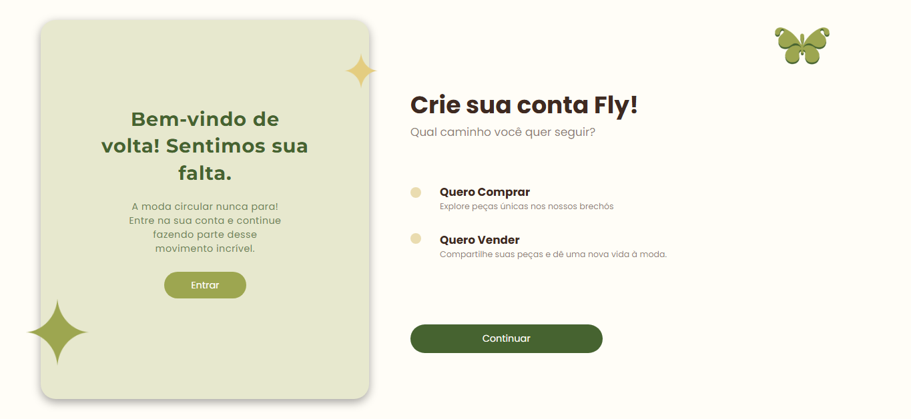
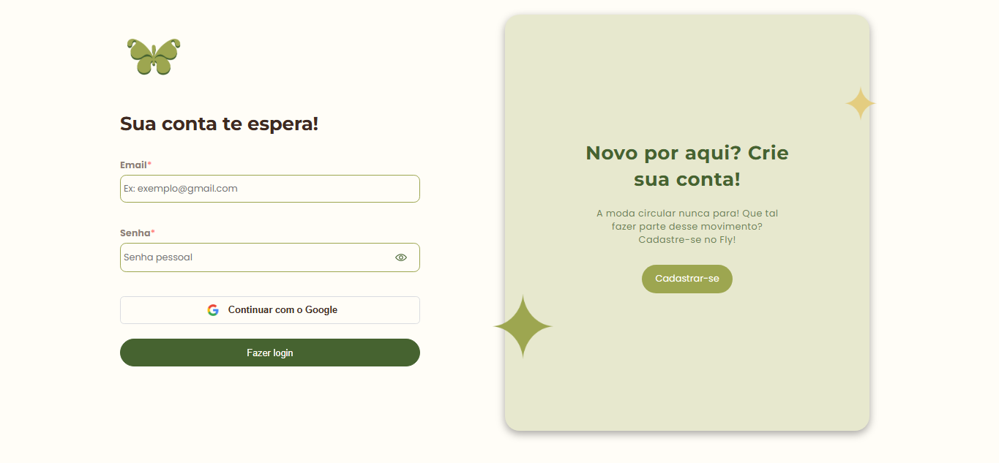
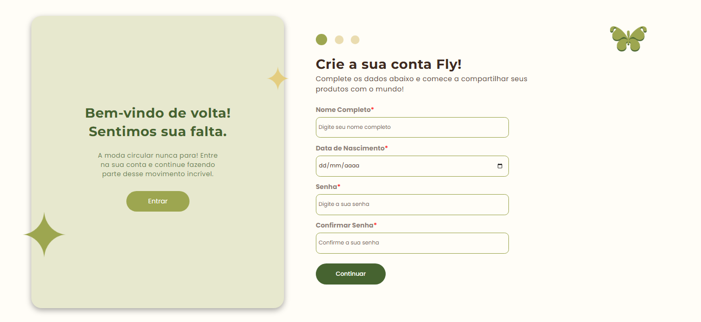
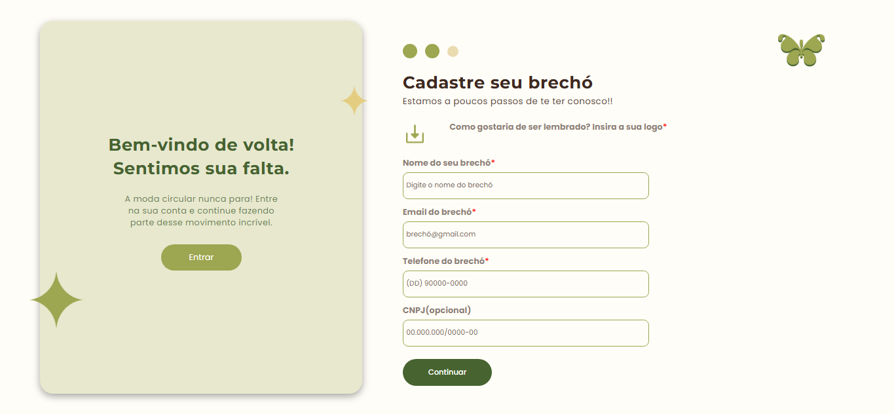
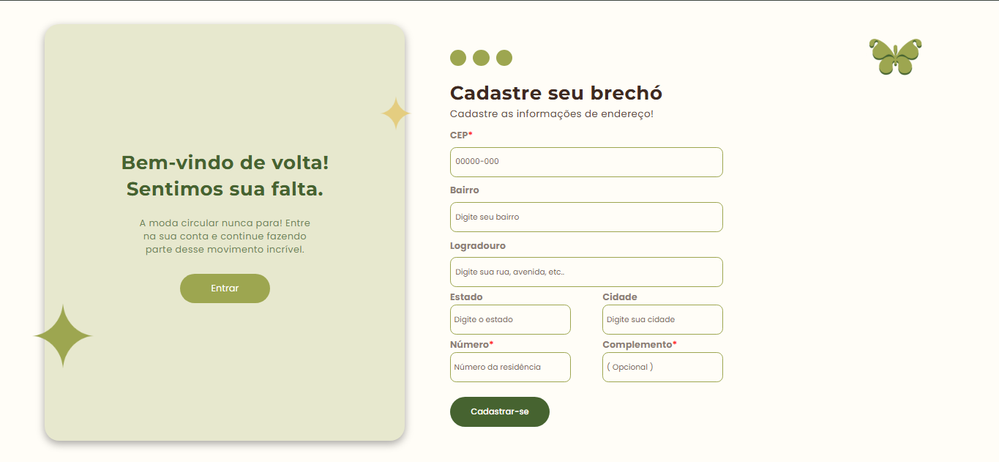
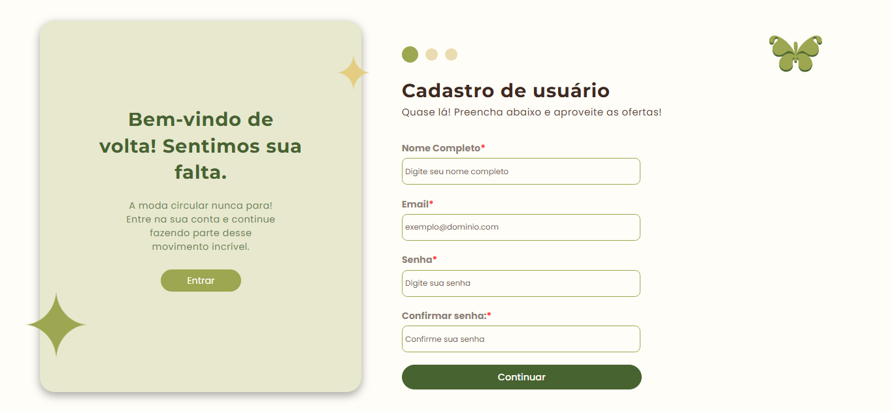
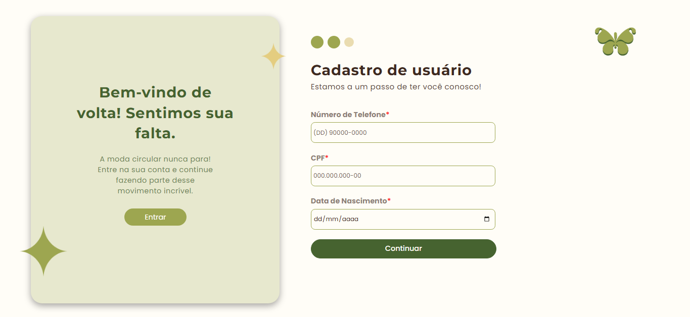
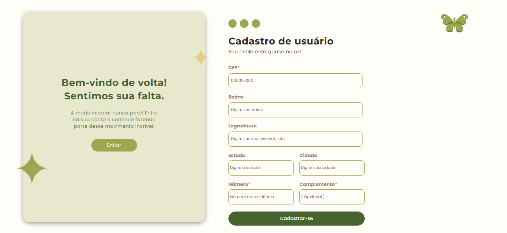

## Descrição
  O Fly é um aplicativo inovador que nasceu com o propósito de dar mais visibilidade aos brechós e facilitar a vida dos consumidores apaixonados pela moda sustentável. A plataforma permite que os usuários encontre brechós e através deles descubram peças únicas, tornando possível fazer compras de forma prática e eficiente.
  A ideia do Fly surgiu da experiência pessoal de um dos membros do nosso grupo de desenvolvedores. Sua mãe é dona de um brechó e, diariamente, enfrenta o desafio de alcançar novos clientes e tornar seu negócio mais conhecido. Essa realidade nos motivou a criar uma solução tecnológica que beneficie tanto pequenos empreendedores quanto consumidores que buscam alternativas mais acessíveis e ecológicas no mundo da moda.
  Com isso, estamos desenvolvendo o Fly, um aplicativo pensado para conectar brechós a um público maior, incentivando o consumo consciente e valorizando peças cheias de história. Acreditamos que, com essa iniciativa, poderemos transformar a forma como as pessoas descobrem e interagem com o universo dos brechós.


| Requisitos Funcionais (RF)    | Descrição                                                                                                             |
|-------------------------------|-----------------------------------------------------------------------------------------------------------------------|
| RF 01 Cadastro de Cliente     | O sistema deve permitir que o usuário possa se cadastrar no site ao preencher as informações requiridas no cadastro.  |
| RF 02 Cadastro de Brechó      | Ao preencher os dados no cadastro, o sistema permite que o dono do brechó consiga anunciar os seus produtos.          |
| RF 03 Login                   | O sistema deve permitir que as pessoas cadastradas possam sair da conta e recuperar as suas informações quando logar. |
| RF 04 Cadastro de Produtos    | O sistema possibilita que o brechó cadastre diversos produtos, adicionando fotos dos produtos, descrições detalhadas, categorias em seus produtos, como por exemplo “Camiseta”, “Saia”, “Vestido Longo” e informações sobre o estado de conservação. |
| RF 05 Busca de Produtos       | O sistema deve possibilitar que o usuário possa buscar produtos por categorias, marca, estilos e tamanhos.            |
| RF 06 Cadastrar Endereços     | O sistema deve permitir que o usuário e o brechó cadastrem seus endereços ao cadastrar-se na plataforma da Fly, assim podendo ser possível localizar o brechó ou realizar alguma entrega de produto de um brechó para algum cliente. |
| RF 07 Gestão de Estoque       | O administrador deve ter acesso a gestão de estoque, onde ele irá conseguir alterar a quantidade de produtos no estoque de determinado brechó. Já o brechó deve conter as mesmas funcionalidades porém somente com seus produtos. |
| RF 08 Sacola de Compras       | O sistema possibilita que o usuário adicione produtos a sua sacola e dentro do pop up, os produtos adicionados terão a logo do brechó no qual eles pertencem, além disso, será permitido que os itens adicionados tenham sua quantidade alterada ou sejam excluídos. |
| RF 09 Entrar em Contato       | O sistema possibilita o usuário a entrar em contato com a empresa Fly em caso de alguma dúvida ou reclamação sobre algo relacionado ao site por meio de uma API de e-mail. |
| RF 10 Dashboard               | O sistema deve disponibilizar um painel de controle (DashBoard) para o administrador do sistema, podendo modificar, excluir ou visualizar: produtos, categorias, brechós, usuários e podendo realizar a gestão de estoque. |
| RF 11 Chat                    | O sistema deve permitir que o usuário entrar em contato com o brechó a respeito dos itens adicionados na sacola, de algum produto especifico ou apenas para tirar uma dúvida. |
| RF 12 Perfil                  | O sistema deve permitir que o usuário e brechó consigam modificar as informações pessoais ao acessar seu respectivo perfil e em qualquer momento consigam excluir a conta no site.|
| RF 13 Produto                 | O sistema permite que o brechó consiga modificar as informações das peças, como tamanho, avarias e o valor e que o produto seja excluído em qualquer momento, a menos que o produto não esteja reservado em determinada compra, além disso, o brechó deve disponibilizar a visualização de todos esses detalhes ao cliente. |
| RF 14 Termos de Uso           | O sistema vai contar com termos de uso, para que quando o usuário criar uma conta ele esteja ciente de seus atos durante o uso do site. |
| RF 15 Política de Privacidade | O sistema permite uma política de privacidade robusta e clara, de maneira que o cliente esteja ciente das normas da empresa. |

## Divisão dos requisitos entre os integrantes

| Integrantes da equipe | Requisitos Funcionais (RF)                                                                                                  |
|-----------------------|-----------------------------------------------------------------------------------------------------------------------------|
| [Mayara Storl](https://github.com/MayaraStorl)          | [RF 03], [RF 09], [RF 12]                                                                 |
| [Maria Eduarda Wolf](https://github.com/dudawl18)           | [RF 01], [RF 02], [RF 03], [RF 06], [RF 12]                                           |
| [Nicholas Serencovich](https://github.com/nicholas-sc-08)  | [RF 01], [RF 03], [RF 05], [RF 06], [RF 08], [RF 10], [RF 11], [RF 13]                 |
| [Rinmarys Alejandra](https://github.com/rinmarys)             | [RF 02], [RF 05], [RF 06], [RF 08], [RF 10], [RF 11], [RF 13]                       |
| [Gabriel Lacerda](https://github.com/GabrielFerLacerda)       | [RF 04], [RF 07], [RF 11]                                                           |


## Protótipos das Telas
### Tela de Início do Cadastro:

  <br/>
### Tela de Login:

  <br/>
### Tela de Cadastro Brechó:
### Etapa Um:

  <br/>

### Etapa Dois:

  <br/>

### Etapa Três:

  <br/>

### Tela Cadastro Cliente:
### Etapa Um: 
  <br/>

### Etapa Dois: 

  <br/>

### Etapa Três:

  <br/>

## Instrução de Instalação
  Este aplicativo ainda está em processo de criação.

## Intrução de Uso

### API's e Bibliotecas para instalação:
  
- Front-End

```nodejs
npm i axios react-router-dom jwt-decode color-namer @react-oauth/google socket.io-client react-imask framer-motion ngrok emailjs-com
```

- Back-End:

```nodejs
npm i cors express cloudinary socket.io nodemon mongoose dotenv stripe
```

## Tecnologias Utilizadas
  Front-end: React<br>
  Back-end: NodeJS<br>
  Banco de Dados: MongoDB.

## Integrantes
Mayara: https://github.com/MayaraStorl <br>
Maria Eduarda Wolf: https://github.com/dudawl18 <br>
Alejandra: https://github.com/rinmarys <br>
Nicholas: https://github.com/nicholas-sc-08 <br>
Gabriel Lacerda: https://github.com/GabrielFerLacerda

## Contas Profissionais
[](https://www.instagram.com/fly.circular/)
[](https://www.linkedin.com/in/fly-circular-76a172352/?locale=pt_BR)

